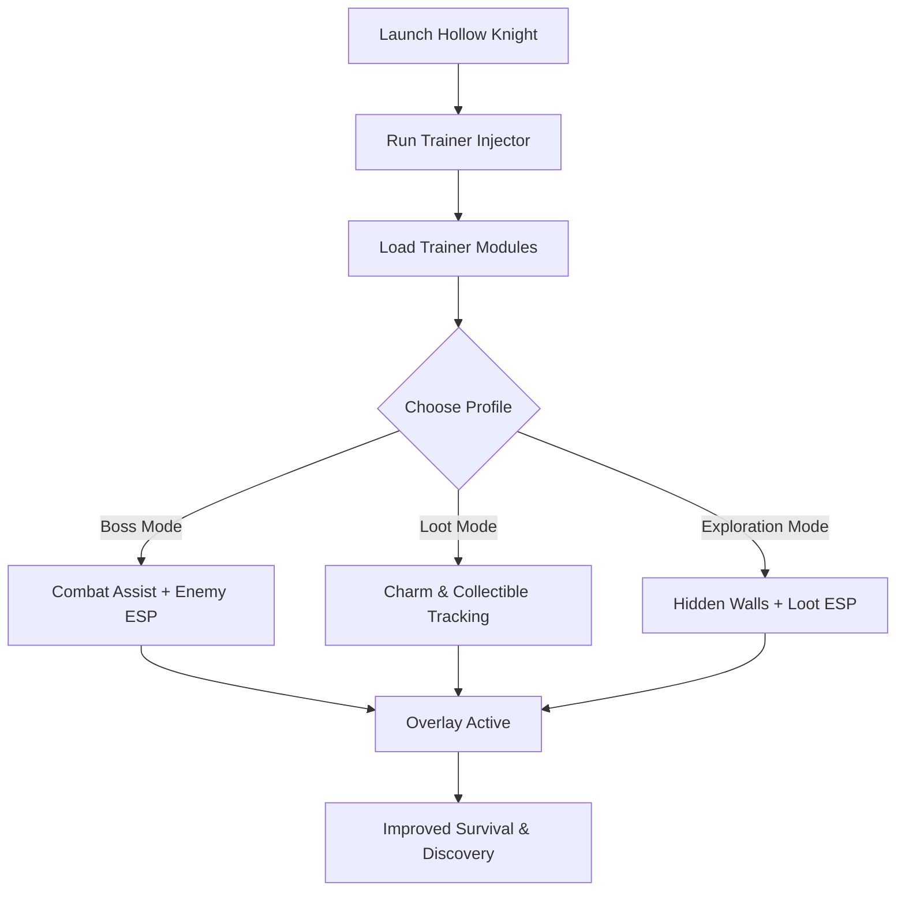

# Hollow Knight Trainer 🐞

**Hollow Knight** is a critically acclaimed metroidvania, known for its challenging combat, labyrinthine world, and hidden secrets. For players seeking extra control, the **Hollow Knight Trainer** introduces **combat assist, ESP overlays, and loot tracking**, streamlining progression while preserving the thrill of exploration.

---

## 🌐 Overview

The trainer is designed as a **multi-function toolkit** to support different playstyles. Switch seamlessly between boss-focused combat profiles, farming setups for charms and resources, or exploration configs to uncover hidden paths. Optimized for **Windows 10/11**, it runs lightweight with minimal system impact.

---

## 🔑 Features

* 👁 **ESP Overlay** – Highlights enemies, loot, and breakable walls.
* 🎯 **Combat Assist** – Configurable FOV, smoothing, and targeting zones.
* 💎 **Loot ESP** – Track charms, collectibles, and rare items.
* 🪶 **Pathfinder ESP** – Reveal destructible walls and hidden routes.
* ⚡ **Ability Manager** – Boost spell damage and nail range.
* 🗂 **Profile Loader** – Save different builds for bosses, farming, or exploring.
* ⌨️ **Hotkey Switching** – Toggle boosts and ESP layers instantly.
* 🔒 **Stealth Injection** – Lightweight module with minimized detection risk.

---

[](#)
[](#)
[](#)
[](#)

---

## 🖥 Compatibility

| Platform       | Status        | Notes                            |
| -------------- | ------------- | -------------------------------- |
| Windows 10     | ✅ Supported   | Stable and smooth                |
| Windows 11     | ✅ Optimized   | Best ESP rendering               |
| Linux (Proton) | ⚠️ Limited    | ESP partial, assists less stable |
| macOS          | ❌ Unsupported | VM workaround required           |

\[!NOTE]
The trainer is best used on **Windows PCs with DirectX rendering**.

---

## ⚙️ Setup Guide

1. Download the Hollow Knight Trainer.

2. Extract files into a secure folder.

3. Launch Hollow Knight.

4. Run the injector as administrator:

   ```bash
   hollowknight_trainer.exe -game hollowknight.exe -mode overlay
   ```

5. Customize your `config.ini`:

   ```ini
   [CombatAssist]
   FOV=70
   Smoothness=7
   Target=Chest
   Hotkey=Mouse5

   [ESP]
   Enemies=True
   Loot=True
   HiddenWalls=True
   EnemyColor=Red
   LootColor=Yellow
   WallColor=Green
   ```

6. Press `Insert` to toggle the overlay menu.

\[!IMPORTANT]
Always inject **after the game fully loads** to avoid failed hooks.

---

## 📊 Workflow Diagram



---

## 🎚 Example Configurations

**Boss Fight Setup:**

```ini
FOV=40
Smoothness=9
Target=Head
Enemies=True
```

**Charm Farming Setup:**

```ini
Loot=True
Enemies=False
HiddenWalls=True
```

**Exploration Setup:**

```ini
Enemies=True
Loot=True
HiddenWalls=True
```

\[!WARNING]
Enabling all ESP layers simultaneously can clutter visuals—stick to focused builds.

---

## ❓ FAQ

**Q: Does this trainer reduce FPS?**
A: No, it runs with <3% system load.

**Q: Can I hot-swap configs mid-game?**
A: Yes, hotkeys allow instant switching.

**Q: Will it reveal every hidden wall?**
A: Yes, all destructible or secret paths are marked.

**Q: Do updates sync with Hollow Knight patches?**
A: Yes, builds are updated alongside patch releases.

**Q: Is stealth injection fully safe?**
A: It reduces risks but is never 100% undetectable.

---

## 🚀 Final Thoughts

The **Hollow Knight Trainer** unifies **combat assists, ESP overlays, and collectible tracking** into a single package. Whether you’re exploring Hallownest’s darkest corners or preparing for a boss encounter, it gives you control and awareness beyond the base game.

[](#)
[](#)
[](#)

---
